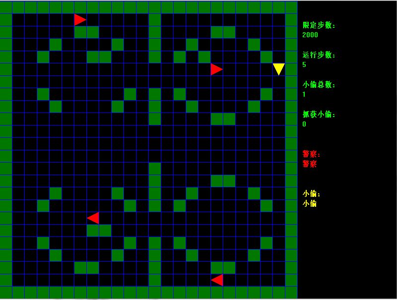

# competition_POL
## Introduction
It's an optimazed project for a game. The game's rule can be listed as follows:

* __red triangle__ represents police-man
* __yellow triangle__ represents thief
* __green square__ represents barriers which one can not go through
* The view of police-man and thief is only 4 around them, which means they can only see the 8*8 area
* for policemen, it's better to catch the thief as soon as possible
* for the thief, it's better to escape as longer as possible

## Algorithm
It is a short-path problem.I mainly apply the [**A star algorithm**](https://en.wikipedia.org/wiki/A*_search_algorithm) to implement the program. [**Here**](./Reference) are my references.

## File Structure
* [**Server**](./Server)  program for server which can start a service for the whole program
* [**Client**](./Client)  program for client which should be running after starting the Server's program
* [**Principle**](./Principle) a excel file and ppt file to explain the principle of the core process of the algorithm
* [**Reference**](./Reference) some articles avalible
* [**PNG**](./PNG) the image of the program's UI
